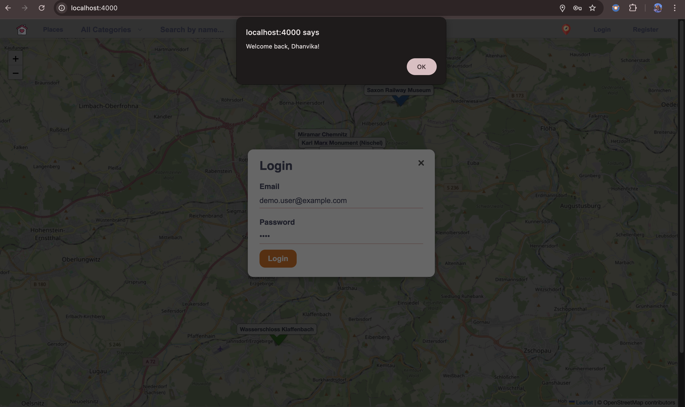

# Chemnitz Culture Map – Web Application

Chemnitz Culture Map is a full-stack web application that allows users to explore cultural locations and points of interest in the city of Chemnitz through an interactive, map-based interface.

The project was developed as part of academic coursework at TU Chemnitz and later extended into a fully functional, deployed web application demonstrating real-world web development practices.

---

## Project Overview

The application enables users to discover cultural places on an interactive map, view detailed information, and interact with content through user accounts.

It focuses on combining geospatial visualization with user-driven features such as authentication, favorites, and comments.

---

## Key Features

- Interactive map of Chemnitz using Leaflet.js and OpenStreetMap  
- Categorized cultural locations with custom map markers  
- User registration and login using JWT authentication  
- User profile management with editable information  
- Save favorite locations  
- Comment system for cultural places  
- RESTful backend APIs for users, places, comments, and favorites  
- Secure data storage using MongoDB Atlas  
- Responsive UI for desktop and mobile devices  

---

## Screenshots

### Map View

### Login & Authentication

### Place Details

---

## Technology Stack

### Frontend
- HTML  
- CSS  
- JavaScript  
- Leaflet.js (OpenStreetMap)

### Backend
- Node.js  
- Express.js  
- MongoDB Atlas  
- Mongoose  
- REST APIs  
- JSON Web Tokens (JWT)

---

## Live Demo

🔗 **Live Application**  
https://chemnitz-culture-backend.onrender.com

> **Note:** The application is hosted on Render’s free tier.  
> The first request may take 30–40 seconds due to cold start behavior.

---

## Repository Structure

chemnitz-culture-map/
├── sourcefile/
│ ├── Frontend/ # Client-side code
│ └── Backend/ # Server-side API
├── screenshots/ # Application screenshots
├── UserGuide.pdf # Academic documentation
└── README.md

---

## Security & Configuration Notes

- Authentication is implemented using JWT  
- Environment variables are used for sensitive configuration  
- `.env` files and `node_modules` are excluded from version control  
- MongoDB credentials are not included in this repository  

---

## Deployment

- Backend deployed on Render  
- Database hosted on MongoDB Atlas  
- Frontend served as static files via the Express backend  
- Environment variables configured securely in the deployment platform  

---

## Author

**Bhavana Rasamsetti**  
Web Engineering – TU Chemnitz  
